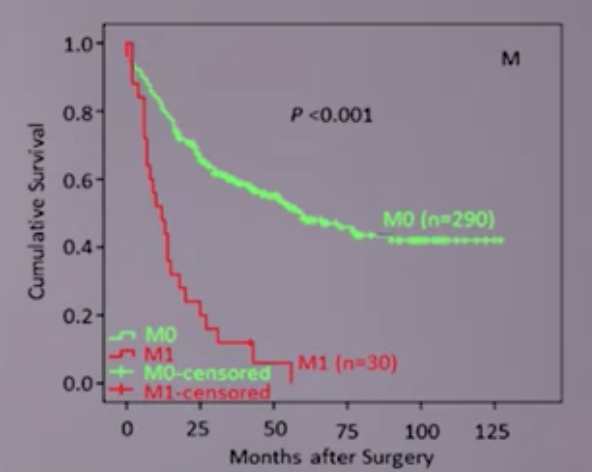
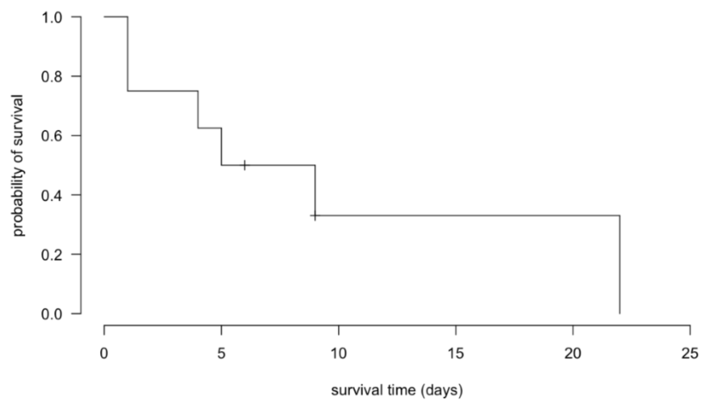

```{r setup, include=FALSE}
knitr::opts_chunk$set(echo = TRUE, 
                      message = FALSE, 
                      warning = FALSE)
library(tidyverse)
library(ggplot2)
```

## what is survival analysis
- modeling "time to event" data
- event of interest not always death
- family of methods, 2 most common = KM, COX
- **events** e.g. death (specific vs non-specific cause), relapse, adverse events
- if non-fatal outcomes, need to deal with people that die before non-fatal outcomes

## vs logistic regression
- LR doesn't care WHEN event happens
- SA cares about WHAT and WHEN
- example:
    - recruit cohort, record diet/ exercise, time of death
    - wait for deaths to accumulate
    - end study in 10 years
- SA accounts for those "lost to follow-up"
    - don't know if event occured
    - LR need to know outcomes for all subjects, or else biased

***
## KM plot and log-rank test

### KM plot
- answers 2 questions
    - how long you have to live
    - chances you will be alive in next 1, 5 years
- allows comparison of survival between patient groups (e.g. treatment vs control)
- **estimates probability of surviving AT LEAST to a given time point**
- probability = <span style="color:Tomato">**survival function**</span> (plotting over time = KM plot)
- example: TNM classification and survival
- KM plot of M0 vs M1 over time
    - {width=250px}
    - at time 0, cumulative survival probability = 1,
    - as time progress, probability falls

### log-rank test
- statistical test to test if differences btw survival curves significant
- p-value of 0.0001 is highly statistically significant

***
## censoring
- <span style="color:Tomato">**censoring**</span> is another central idea in survival analysis
- patient dropped out of study
- different types of censoring
    - drop out of study
    - people still alive (or did not have event) at end of study

***
## life tables
- measures:
    - probability of death at a given age, and
    - life expectancy at varying/different ages
- 2 different kind of life tables
    - **cohort**/ generational life table
    - **period**/ current / static life table

### cohort life table
- take a set of people born at the same time, follow them up to death
- e.g. Millenium cohort study in UK
- might not be relevant for people born at other time points
- longitudinal, same group of people moving through time

### period life table
- take a hypothetical cohort of people born at the same time,
- assumption = all subject to age-specific mortality rates of a region/country
- mortality rate taken from age-specific death rates during census year + a year on either side
- cross sectional, population is different age groups at a moment in time
>
```
wikipedia
    - life table = mortality table = actuarial table
    - shows for each age, probability of death before his/her next birthday
    - i.e. survivorship of people from certain population
    - period life table
        - mortality rates during specific time, of certain population
        - for people of different ages, in the current year
    - cohort life table
        - overall mortality rate (probably of death),
          over course of their lifetime, of certain population
    - period and cohort life table same if
        - population in equilibrium (constant number of people each year)
        - environment does not change
```


## cohort study
- cohort of patients enrolld at time zero,
- followed up to log when outcome of interest happens (e.g. death)

### constructing life table
```{r echo=FALSE, results="asis"}
life_table <- data.frame(c("0 (study starts)", "1", "2", "3"),
                         c("100","100","98","??"),
                         c("0", "2", "??", "??"),
                         c("1", "0.98", "??", "??"))
names(life_table) <- c("time(t) in days", 
                       "#patients alive at time t", 
                       "#patients died at time t",
                       "probability of survival past time t")
knitr::kable(life_table)
```

- start with 100 patients
- all makes it past time 0
- prob of surviving at least to t=0 is 1
- 2 people die at t=1, P(Surv) = 0.98
<br><br>
- this assumes eeryone enters study at the same time (t=0),
- and no one leaves study, except death

***
## calc plot KM by hand
- KM can estimate survival curve empirically from observed survival times, 
    - without assumption of underlying probability distribution
- (other survival analysis do require an underlying distribution of survival times)
- KM has no assumptions (no need to test if assumptions are valid)
<br><br>
- proportion = pts alive at end of time t/ pts alive at begining of time t
- probability = prob of surviving past day t-1 * proportion of pts alive at time t
- censoring
    - we know pt alive at time t, but do not know when event occured
    - censored pt not classified as survived or died
    - simply deduct censored pts from #alive
    - when there's both pt died and censored, <span style="color:Tomato">count num_death first</span>
        - calculate proportion surviving first,
        - then deduct num_censored from num@risk to arrive at num@risk for next time point
        - e.g. t=12, n.risk=10, 3 died and 1 censored
            - proportion surviving @ t=12 = (10-3)/10
            - t=13, n.risk = 10-3-1 = 6
- if no one dies at time t
    - proportion = 1
    - P(Surv) unchanged
    - KM plot stays flat
```{r echo=FALSE, results="asis"}
km_table <- data.frame(c("0 (study starts)","1","4","5","6+","9","9+","22"),
                       c("8 pts recruited","8","6","5", "4","3","2","1"),
                       c("0","2","1","1","0 (1pt leaves)","1","1pt leaves","1"),
                       c("(8-0)/8=1","(8-2)/8=0.75","(6-1)/6=0.83","(5-1)/5=0.8","4/4=1","(3-1)/3=0.667","2/2=1","0/1=0"),
                       c("1","1*0.75 = 0.75","0.75*0.83 = 0.623","0.623*0.8 = 0.498","0.498*1 = 0.498","0.498*0.667 = 0.332","0.332*1 = 0.332","0"))
names(km_table) <- c("time(t) in days",
                     "#pts alive at time t",
                     "#pts died at time t",
                     "proportion of pts surviving (at) past time t",
                     "probability of survival past time t")
knitr::kable(km_table)
```

### final KM plot
- {width=500px}


## EOF